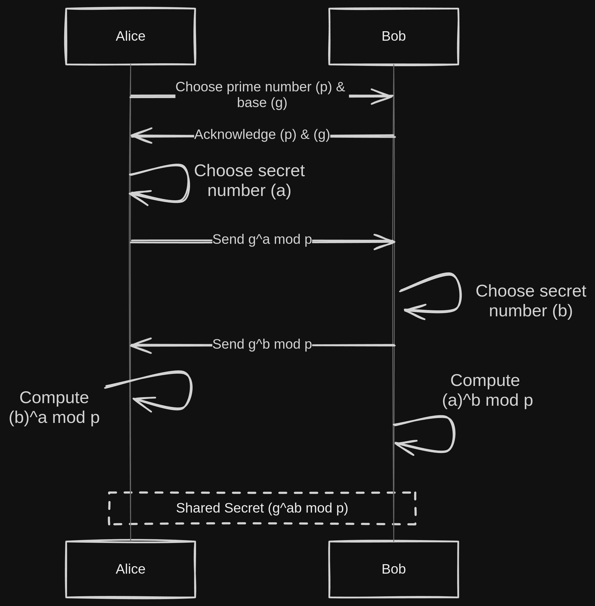

# Diffie-Hellman Key Exchange in Go

🔐✨ "The Secret Keepers' Club" ✨🔐

Welcome to the digital realm's most exclusive club, where Alice and Bob outwit onlookers, especially the notorious Mallory, with the legendary Diffie-Hellman key exchange. Here, secrets are shared openly, yet remain cloaked in cryptic elegance.

🎩🐇 Discover the magic of secomm, where secrets are swapped faster than a magician's trick. It's not just mathematics; it's the art of cryptography!

Step into a world where a simple "What's your number?" unfolds into an adventure of encrypted camaraderie and fun.

## Overview of Diffie-Hellman Key Exchange
The Diffie-Hellman Key Exchange algorithm is a method of securely exchanging cryptographic keys over a public channel. It was one of the first public-key protocols as originally conceptualized by Ralph Merkle and named after Whitfield Diffie and Martin Hellman. The core idea is to allow two parties - traditionally referred to as Alice and Bob - to agree on a shared secret key, used for subsequent encryption, without having to transmit that key to each other.

This is achieved by each party generating a private key and a corresponding public key. These public keys are then exchanged over the public channel. The shared secret is computed independently by both parties using their private key and the other party's public key. Due to the mathematical properties of the algorithm, both parties end up with the same shared secret.

### Scheme of Diffie-Hellman Algorithm
Below is a schematic representation of the Diffie-Hellman Key Exchange algorithm, which illustrates the process:



## secomm/src/secomm.go

`secomm` is a Go-based tool for secure file and directory transmission over a network, leveraging Diffie-Hellman key exchange, AES encryption, and ZIP compression.

### How to Use secomm

1. **Sending Files:**
   - Run the command `./secomm -s <path> <port>` to send a file or directory.
   - `<path>` is the file or directory path, and `<port>` is the server's listening port.

2. **Receiving Files:**
   - To receive, execute `./secomm -r <ip> <port>`.
   - `<port>` is the connection port, and `<ip>` is the server's IP address.

### Key Features
- **Installation**: Clone and build from the repository. 
  ```bash
  git clone https://github.com/sg1o/secomm.git
  cd secomm
  go build .
  sudo mv secomm /usr/bin/
  ```
- **Verbose Output Options**: Use `-v` for verbose and `-vv` for very verbose output.
- **Help**: Access help with `--help`.

### Examples
- **Send a file**: `./secomm -s ./example.txt 8080`
- **Receive a file**: `./secomm -r 192.168.1.100 8080`

## diffie/interchange.go
This Go program demonstrates a simple implementation of the Diffie-Hellman Key Exchange protocol. It consists of two parts: a server (Bob) and a client (Alice).

### How to Use diffie/interchange.go
1. **Run the Server (Bob):**
   - Start the server by running `go run interchange.go <port>`, where `<port>` is the port number you wish to use for the server.
   - The server will generate a prime number `p` and a base `g`, and wait for a client connection.

2. **Run the Client (Alice):**
   - Start the client by running `go run interchange.go <port> <server IP>`, where `<port>` is the port number and `<server IP>` is the IP address of the server.
   - The client will connect to the server, receive `p` and `g`, and proceed with the key exchange.

3. **Key Exchange Process:**
   - Both the server and client will display their private and public keys.
   - Once the public keys are exchanged between them, both compute the shared secret key and display it.

## Dependencies
- Go programming language

## Disclaimer
This implementation is for educational purposes and should not be used in production environments.
